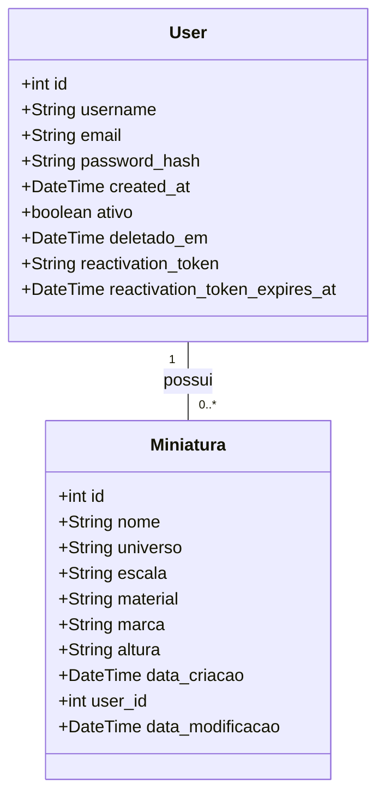

# Diagrama de Classes do Sistema de Miniaturas

```mermaid
classDiagram
    class User {
        +int id
        +String username
        +String email
        +String password_hash
        +DateTime created_at
        +boolean ativo
        +DateTime deletado_em
        +String reactivation_token
        +DateTime reactivation_token_expires_at
    }
    class Miniatura {
        +int id
        +String nome
        +String universo
        +String escala
        +String material
        +String marca
        +String altura
        +DateTime data_criacao
        +int user_id
        +DateTime data_modificacao
    }
    User "1" -- "0..*" Miniatura : possui
```
