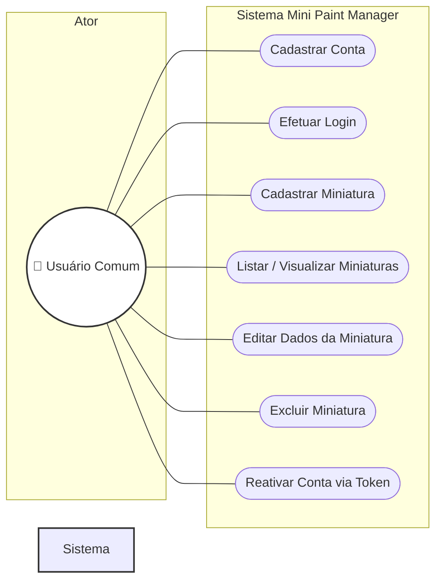

# uml

```mermaid
flowchart LR
    %% Definição do Ator com formato de boneco/texto
    subgraph Ator
        user((👤 Usuário Comum))
    end

    %% Fronteira do Sistema (Retângulo)
    subgraph Sistema Mini Paint Manager
        UC1([Cadastrar Conta])
        UC2([Efetuar Login])
        UC3([Cadastrar Miniatura])
        UC4([Listar / Visualizar Miniaturas])
        UC5([Editar Dados da Miniatura])
        UC6([Excluir Miniatura])
        UC7([Reativar Conta via Token])
    end

    %% Ligações do Ator com as Funcionalidades
    user --- UC1
    user --- UC2
    user --- UC3
    user --- UC4
    user --- UC5
    user --- UC6
    user --- UC7

    %% Estilização para parecer Casos de Uso acadêmicos
    style Sistema Mini Paint Manager fill:#f9f9f9,stroke:#333,stroke-width:2px
    style user fill:#fff,stroke:#333,stroke-width:2px
```
